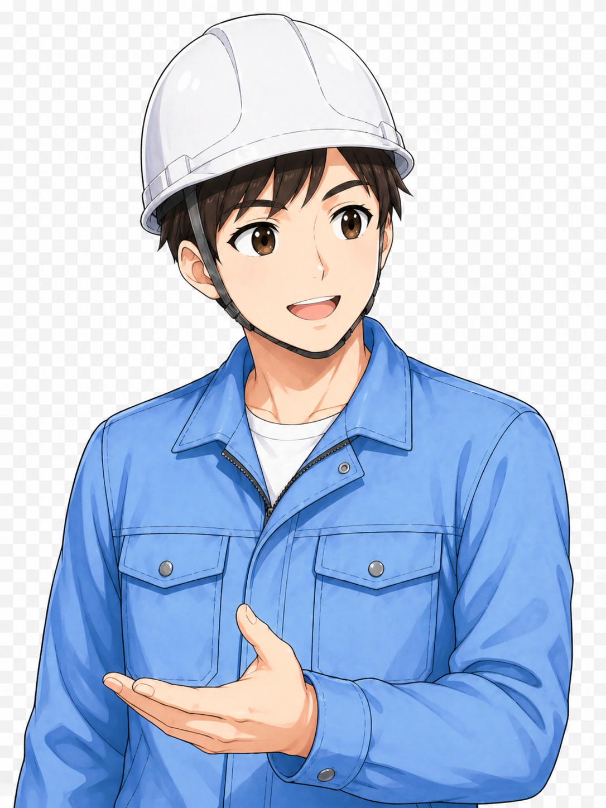

# 画像生成ルール（image generation rules）

## 目的
このドキュメントは、画像生成ルールを「全記事共通ルール」と「記事タイプ別ルール」に分け、画像生成エージェントが以下の記事タイプすべてで迷わずに使えるようにする。

- GX Works3命令語シリーズ
- 制御の基礎記事
- 比較・使い分け記事

---

## A. 全記事共通ルール

### 1) 画像設計の基本
- 記事画像は「ChatGPTでこれまで作ってきた教育系・図解系の雰囲気」を維持する。
- 画像は用途ごとに別ファイルで作成する（1枚1用途）。
- 1回の画像生成指示では1枚分だけ扱う。
- 他の画像用途を混ぜない（hero / ogp / overview / comparison / flow系を混在させない）。
- 白背景、青ベース、補助色として緑・黄・赤を少し使う。
- 白背景ベース・青系中心・整理された図解を基本にし、スマホでも理解しやすい見た目を優先する。
- 文字は大きく、記事内画像として読みやすくする。
- 1枚に情報を詰め込みすぎない。
- 実在メーカーUI、ロゴ、製品画面は入れない。
- 記事画像の拡張子は原則 `.png` とする。

### 1.5) 記事画像ジェネレーターの基本原則（雰囲気維持）
- 記事画像は、ChatGPTでこれまで作ってきた教育系・図解系の雰囲気を維持する。
- 基本トーンは、白背景ベース・青系中心・整理された図解・スマホでも理解しやすい見た目にする。
- 画像は原則 `.png` で作成する。
- 1回の画像生成では1枚の用途だけを作る。
- 1枚に複数用途を混ぜない。
- `hero / ogp / overview / comparison / check-flow` などの役割を混ぜない。
- 実在メーカーUI、実在ソフト画面、実在ロゴは入れない。
- 文字を詰め込みすぎない。
- 図解、表、フロー、見出しの主役が分かる構成にする。
- サイト全体の雰囲気から外れる派手すぎる画像、黒背景中心、広告っぽい画像、海外工場広告風の画像は避ける。

### 1.6) 同一記事5枚セットの統一ルール
- 同一記事の5枚画像は、バラバラに作らず統一感を持たせる。
- 最初に `hero` を作ってアンカー画像とする。
- `overview / comparison / check-flow / ogp` は、guide-characters参照画像に加えて、採用済み `hero` 画像も参照して作る。
- 後続画像では、キャラクターの顔、服装、ヘルメット、線の太さ、配色、図解トーンを `hero` に合わせる。
- 5枚のうち1枚だけ別テイストになっている場合はNGとする。
- NGの場合は、該当画像だけ再生成する。

### 2) キャラクター統一ルール（全記事共通）
- 新規記事の画像生成では、記事ごとの画像を作る前に、共通キャラクターテンプレートを必ず確認する。
- 参照先：
  - `assets/images/character-templates/senpai-kouhai-character-template.png`
  - `assets/images/character-templates/senpai-kouhai-chibi-character-template.png`
- 人物キャラクターを含む画像では、必ず `assets/images/guide-characters/` の参照画像を使う。
- 参照なしで人物キャラクターを生成しない。
- 新しい別キャラを勝手に作らない。
- 先輩・後輩キャラは、既存記事と同じ人物・同じ雰囲気として扱う。
- 人物キャラクターを含む画像では、必ず `guide-characters` の参照画像を一緒に使う。
- 参照なしで人物キャラクターを生成しない。
- 新しい別キャラを勝手に作らない。
- 毎回別人のように見えるデザイン変更はしない。
- 顔、頭身、服装、ヘルメット、雰囲気、役割を崩さない。
- 髪型、ヘルメット、作業服、色味、親しみやすい表情の方向性を維持する。
- 既存記事のキャラクターと並べても違和感がないことを基準にする。

先輩キャラの固定条件：
- 白ヘルメット
- 青系作業服
- 親しみやすい説明役
- 20代前半男性風
- フレンドリーで頼れる雰囲気

後輩キャラの固定条件：
- ライトブルー系ヘルメット
- ライトグレー〜ライトブルー系作業服
- 学ぶ姿勢
- 20代前半女性風
- 素直で前向きな雰囲気

NG例：
- 別人のような顔になる
- 頭身が大きく変わる
- 服装やヘルメット色が変わる
- 妙にリアル寄りになる
- 海外アニメ風になる
- キャラクターが主役になりすぎて図解が読みにくくなる
- 記事テーマに応じてポーズや表情は変えてよい。
- ただし、キャラクターの基本設定は変えない。
- 顔、頭身、服装、ヘルメット、雰囲気、役割を崩さない。
- 固定条件（先輩）：
  - 白ヘルメット
  - 青系作業服
  - 親しみやすい説明役
  - 20代前半男性風
  - フレンドリーで頼れる雰囲気
- 固定条件（後輩）：
  - ライトブルー系ヘルメット
  - ライトグレー〜ライトブルー系作業服
  - 学ぶ姿勢
  - 20代前半女性風
  - 素直で前向きな雰囲気

### 2.1) 同一記事5枚セットの統一ルール
- 同一記事の画像5枚はバラバラに作らず、1セットとして統一感を持たせる。
- 最初に `hero` を作成し、アンカー画像として採用する。
- `overview` / `comparison` / `check-flow` / `ogp` は、`guide-characters` 参照画像に加えて、採用済み `hero` 画像も参照して作る。
- 後続画像では、キャラクターの顔・服装・ヘルメット・線の太さ・配色・図解トーンを `hero` に合わせる。
- OK判定前に次の用途画像へ進まない。

### 3) `guide-characters` と `character-templates` の役割違い
- `assets/images/guide-characters/`
  - 記事HTML本文内の会話ブロック、注意ボックス、本文中のキャラ素材として使う。
  - 既存記事内で直接表示される素材。
- `assets/images/character-templates/`
  - 今後の画像生成時に、先輩・後輩キャラの見た目を統一するための参照テンプレート。
  - 画像生成エージェントが雰囲気合わせのために参照する画像。
- 上記2つは混同しない。

### 4) 全記事共通の不採用基準
以下に該当する画像は採用しない。

- 文字が崩れて読めない
- 1枚の用途から外れている
- 複数用途の内容が1枚に混ざっている
- 既存の先輩・後輩キャラと別人に見える
- 記事ごとにキャラの顔・服装・雰囲気が大きく変わっている
- 共通キャラクターテンプレートから大きく外れている
- 実在メーカーUI・ロゴ・製品画面が入っている
- 記事テーマと違う用語や題材が入っている
- 情報量が多すぎて読みづらい
- ちびキャラが大きすぎて本文図解より目立っている
- 先輩と後輩の役割が逆に見える

### 5) 画像生成プロンプトに含める共通考え方
必要に応じて、画像生成プロンプトには以下を含める。

- この画像は何枚中の何枚目かを明記する
- 他の画像の内容を混ぜない
- 共通キャラクターテンプレートを参照して、先輩・後輩キャラの見た目を統一する
- 白背景、青ベース、補助色は緑・黄・赤を少し使う
- 文字は大きく、記事内画像として読みやすくする
- 1枚に情報を詰め込みすぎない
- 必要に応じて親しみやすい会話や吹き出しを入れてよい
- 実在メーカーUIやロゴは入れない


### 5.5) 画像用途ごとの人物ルール
- hero
  - 記事上部のメイン画像。
  - 記事タイトルまたは記事テーマが分かる短いタイトル文を必ず入れる。
  - 基本は先輩1人。
  - 全身または上半身。
  - 説明役として自然に配置する。
  - 左側にはHTMLのh1やリード文が重なるため、重要な文字、キャラクター、図解を左側に寄せすぎない。
  - 画像内タイトルは右側または中央右寄りに配置する。
  - タイトル文字はスマホでも読める大きさにする。
  - 細かい表、小さい注釈、本文図を詰め込みすぎない。
  - hero画像にタイトルまたは記事テーマ文が入っていない場合はNGとし、再生成する。
- ogp
  - SNSやリンク共有用サムネイル。
  - 基本は先輩1人まで。
  - 記事テーマが一目で分かる大きなタイトル中心。
  - 細かい図表や小さい文字を入れすぎない。
  - 小さく表示されても意味が伝わる構成にする。
- overview
  - 本文の基本説明図。
  - キャラなし、または先輩1人まで。
  - 主役は図解。
  - 記事の最初の理解に役立つ構成にする。
  - OGP風のタイトルだけ画像にしない。
- comparison
  - 比較・違いを整理する画像。
  - 必要なら先輩＋後輩可。
  - ただし比較表や違いの整理が主役。
  - キャラクターを主役にしすぎない。
  - 比較対象がひと目で分かる構成にする。
- check-flow
  - 確認手順の画像。
  - 基本は先輩1人。
  - STEP形式で整理する。
  - 上から下、または左から右に確認順が自然に追える構成にする。
  - 比較表やoverview用の内容を混ぜない。

### 5.6) 画像用途別の固定レイアウトルール
- hero画像
  - 記事上部の背景画像・メインビジュアルとして使う。
  - 右側にメインイラスト、機器、キャラクター、図解要素を置く。
  - 左側はHTMLのh1、リード文、ボタンが重なる前提で、重要な文字・人物・機器・図解を寄せすぎない。
  - 画像内テキストは、記事テーマが分かる短い英語タイトルまたは短い補足文までにする。
  - 表、チェックリスト、細かい説明、複雑なラダー図、長文は入れない。
  - 画像内タイトルを入れる場合は、中央右寄りまたは右側に配置する。
  - キャラクターはテンプレートの先輩・後輩の雰囲気を守り、記事の主役ではなく案内役として配置する。
  - hero画像は、後続画像のトーン・配色・線の太さ・キャラ雰囲気の基準になるアンカー画像として扱う。
- OGP画像
  - SNSやリンク共有で使うサムネイル画像として作る。
  - 中央に大きく記事タイトルを置く。
  - 左右または下部に、キャラクター・機器・テーマを示すアイコンを補助的に配置してよい。
  - 小さく表示されても記事テーマが分かる構成にする。
  - 情報量はheroよりさらに少なくする。
  - 細かい表、チェックリスト、複雑なフロー、ラダー詳細、長文説明は入れない。
  - 記事内説明図のようにしない。
  - OGPは「説明する画像」ではなく「テーマを一目で伝える画像」として扱う。
- 記事内画像 overview
  - 記事本文の基本説明図として使う。
  - 画像上部に短い用途タイトルを入れてよい。
  - 中央に、基本構造・全体像・仕組みの図解を置く。
  - hero/OGP風の大きなタイトル画像にしない。
  - キャラクターはなし、または小さめの補助として使う。
  - 主役はキャラクターではなく図解にする。
- 記事内画像 flow / operation-flow / timer-flow / signal-flow
  - 動作順、信号の流れ、時間の流れ、確認の流れを説明する画像として使う。
  - 左から右、または上から下に自然に追える構成にする。
  - 1枚につき1つの流れだけを扱う。
  - 他用途の比較表、heroタイトル、OGP要素、現場チェック項目を混ぜない。
  - 矢印、STEP、状態変化、ON/OFF、入力/出力などを整理して見せる。
  - キャラクターは補助に留める。
- 記事内画像 ladder-logic / circuit-logic
  - ラダーや回路の考え方を説明する画像として使う。
  - 入力条件、内部条件、タイマー/フラグ、出力コイルなど、信号の関係を整理する。
  - 実在メーカーのPLC画面や実在ソフトUIの再現はしない。
  - ラダー風の簡略図は使ってよいが、細かすぎる接点名や小さい文字を詰め込まない。
  - 現場チェック、heroタイトル、OGP要素を混ぜない。
- 記事内画像 check-flow / field-checks
  - 現場確認やトラブル時の確認順を説明する画像として使う。
  - STEP形式で整理する。
  - 上から下、または左から右に確認順が追える構成にする。
  - 1ステップ1要素を基本にし、細かい説明文を詰め込みすぎない。
  - heroタイトル、OGP要素、overviewの全体説明、詳細ラダー図を混ぜない。
  - キャラクターは確認を案内する補助役として小さめに使う。

### 5.7) 複数画像依頼時の解釈ルール
- ユーザーが「全部ください」「残り全部ください」「記事画像を一気にください」と言った場合でも、1枚にまとめたコラージュ画像を作らない。
- 複数画像を1枚のグリッド、6分割、一覧、ポスター、セット画像、スライド風にまとめない。
- 「全部」とは、保存名ごとに別々の画像を連続で作るという意味で扱う。
- 1回の画像生成では1枚だけを作る。
- 複数枚必要な場合は、保存名順に1枚ずつ個別生成する。
- それぞれの画像は、個別ファイルとして保存できる構図にする。
- 各画像の下にファイル名ラベルを入れない。
- 画像の中に「1枚目」「2枚目」などの番号ラベルを入れない。
- 画像生成前に、今回作る1枚の保存名・用途・入れる要素・禁止要素を明記する。
- 採用/不採用の判定後に次の画像へ進む。
- ただしユーザーが明示的に「確認不要で次へ」と言った場合は、1枚ずつ連続生成してよい。

### 5.8) 採用済みheroを基準にした後続画像ルール
- hero画像が採用されたら、その記事の後続画像はheroをアンカー画像として扱う。
- 後続画像では以下をheroに合わせる。
  - キャラクターの顔つき
  - ヘルメット色
  - 作業服色
  - 線の太さ
  - 青白ベースの配色
  - 図解のトーン
  - 全体のやさしい教育系の雰囲気
- ただし、heroの構図やタイトル要素を後続画像にそのまま流用しない。
- OGPはOGPとして、overviewはoverviewとして、flowはflowとして、各用途に限定する。
- 後続画像がhero/OGP風のタイトル画像になってしまった場合はNGとする。
- 後続画像が記事内画像ではなく広告バナーやWebページモックアップ風になった場合はNGとする。

### 5.9) 画像生成前の宣言テンプレート
画像生成前には、以下の形で必ず1枚分だけ宣言する。

```text
今回生成する画像:
[slug-xxx.png]

用途:
[hero / ogp / overview / flow / ladder-logic / field-checks など]

この画像で伝えること:
- [この1枚で伝える内容]

入れる要素:
- [必要な要素]
- [必要な短い英語テキスト]
- [必要な図解要素]

入れない要素:
- 他用途の内容
- コラージュ
- 6分割
- WebページUI
- ファイル名ラベル
- 実在メーカーUI
- 長文
- 細かすぎる表
```

### 5.10) オーケストレーター→記事画像ジェネレーター依頼テンプレート
```text
記事画像生成依頼

記事タイトル:
[記事タイトル]

記事slug:
[slug]

画像用途:
[hero / ogp / overview / comparison / check-flow]

出力ファイル名:
[slug-hero.png など]

参照画像:
- guide-characters のキャラクターテンプレート
- 同一記事で先に採用した hero 画像（hero以外のとき）
- 必要なら既存の成功画像サンプル

今回使うキャラクター:
[先輩のみ / 後輩のみ / 先輩+後輩 / キャラなし]

キャラクター固定条件:
- 先輩: 白ヘルメット、青系作業服、親しみやすい説明役
- 後輩: ライトブルー系ヘルメット、ライトグレー〜ライトブルー系作業服、学ぶ姿勢
- 顔、頭身、服装、色味は参照画像の雰囲気を維持
- 新キャラ化しない
- 別テイスト化しない

画像の役割:
[この画像で伝えるべき内容を1〜3行で明記]

必須要素:
- [入れるべき内容]
- [入れるべき見出し]
- [必要な図や表]
- [必要なSTEPや比較]

hero画像の場合の必須要素:
- 記事タイトルまたは記事テーマが分かる短いタイトル文を必ず入れる
- タイトルは右側または中央右寄りに配置する
- 左側にはHTMLのh1やリード文が重なるため、重要文字を寄せすぎない

禁止要素:
- 他用途の内容を混ぜない
- 実在メーカーUIやロゴを入れない
- 小さすぎる文字を大量に入れない
- キャラを主役にしすぎない
- 参照と違う別キャラにしない
- 1枚に複数用途を混ぜない
- hero画像でタイトルなしにしない

デザイン条件:
- 白背景ベース
- 青系中心
- ChatGPTでこれまで作ってきた教育系・図解系の雰囲気
- 見やすく、整理され、スマホでも理解しやすい
- 情報の優先順位が明確
- 図解・表・見出しを整理して配置

生成後の自己検品:
- 用途一致
- キャラ一致
- 構図一致
- 禁止要素なし
- 読みやすさOK
- hero画像の場合、記事タイトルまたは記事テーマ文が入っている
- NGならその画像だけ再生成
```

### 6) 本文内ガイドキャラ運用ルール
- 本文内で使う人物キャラクターは `assets/images/guide-characters/` 内の既存キャラを使う。
- 新しい別キャラや別テイストの人物画像を勝手に増やさない。
- 基準キャラ：
  - 先輩キャラ：`assets/images/guide-characters/friendly_worker_with_helmet_and_smile.png`
  - 後輩キャラ：`assets/images/guide-characters/curious_worker_with_a_cheerful_expression.png`
- 先輩は説明・補足・判断の役。
- 後輩は質問・気づき・理解確認の役。
- 会話は「後輩の疑問 → 先輩の説明」または「先輩の説明 → 後輩の理解・質問」の流れにする。
- 会話画像は必ず `div.talk-avatar > img` に入れる。
- 会話欄では `.talk-avatar` / `.talk-avatar img` の既存サイズを使う。
- 注意ボックス用の小さいキャラサイズを会話欄に流用しない。

### 7) 注意ボックス内のキャラ構造ルール
- 注意・補足・安全関連の `note-box` / `danger-box` では、先輩キャラまたは先輩チビキャラを小さく添えてよい。
- 注意ボックス内では、キャラが本文より目立ちすぎないようにする。
- 注意ボックス内では、頭身の高い立ち絵や別テイスト画像を使わない。
- `h3` と `p` は、キャラ右側の同じ `div` 内にまとめる。
- `h3` だけを `caution-character-box` の外に出さない。
- 注意ボックス内のキャラサイズは、既存CSSの `.caution-character-box` / `.caution-character` / `.caution-character img` に従い、新規CSSを勝手に作らない。

基本HTML構造：

```html
<div class="danger-box caution-character-box">
  <div class="caution-character">
    
  </div>
  <div>
    <h3>注意見出し</h3>
    <p>注意本文を入れる。</p>
  </div>
</div>

<div class="note-box caution-character-box">
  <div class="caution-character">
    
  </div>
  <div>
    <h3>補足見出し</h3>
    <p>補足本文を入れる。</p>
  </div>
</div>
```

### 8) 先輩チビキャラ画像の運用ルール
使用する画像と用途：

- `assets/images/guide-characters/senpai-chibi-pointing.png`
  - ここ注意
  - よく間違えるポイント
  - 配線・接点・回路の見落とし注意
  - 注意ボックスへ視線誘導したい場合

- `assets/images/guide-characters/senpai-chibi-guide.png`
  - 通常の案内
  - 補足説明
  - 読み進め方のガイド
  - まずここを見ればOK

- `assets/images/guide-characters/senpai-chibi-idea.png`
  - コツ
  - 覚え方
  - ひらめき・理解の助け
  - こう考えると分かりやすい

使用ルール：
- 新しい別キャラを勝手に作らず、まずはこの3枚を使う。
- 記事内では主役にしすぎず、注意・補足・覚え方の補助として小さく使う。
- 1記事あたり1〜3か所までを目安にする。
- 本文の読みやすさを優先する。
- スマホでは大きくしすぎない。
- 背景つき画像やチェック柄背景が焼き付いた画像は使わない。
- 画像を差し替える場合も、同じファイル名・同じ用途を維持する。

---

## B. 記事タイプ別ルール

### 1) GX Works3命令語シリーズ

#### 原則5枚構成
- `slug-hero.png`
- `slug-ogp.png`
- `slug-overview.png`
- `slug-comparison.png`
- `slug-check-flow.png`

#### 役割
- hero
  - 記事トップ用メイン画像
  - 左側にHTML文字が乗る余白を残す
  - 細かい表や長文は入れない
  - 基本は先輩1人（全身または上半身）で説明役にする
- ogp
  - SNS・共有用サムネイル
  - タイトル大きめ
  - 細かい表や小さい文字は入れない
  - `og:image` / `twitter:image` に使う
  - 基本は先輩1人まで。情報量を絞り、細かい図表は入れない
- overview
  - 命令語の基本動作説明図
  - データの流れ、値の移動、成立条件などを説明
  - キャラなし、または先輩1人まで。主役は図解
- comparison
  - 命令同士、通常実行とパルス実行、似た命令の使い分け比較
  - 必要なら先輩＋後輩可。ただし比較表を主役にする
- check-flow
  - 動かない時の確認手順
  - 例：実行条件 → 元データ → 格納先 → 上書き → データ幅
  - 基本は先輩1人で確認手順の案内役にする

#### 標準配置
- hero：`.article-hero::before`
- ogp：`og:image` / `twitter:image`
- overview：最初の基本説明セクション
- comparison：使い分け・比較セクション
- check-flow：確認手順・トラブルシュートセクション

#### 生成順
1. hero
2. ogp
3. overview
4. comparison
5. check-flow

### 2) 制御の基礎記事

#### 基本構成（原則5枚。記事テーマにより4〜5枚で調整可）
- `slug-hero.png`
- `slug-ogp.png`
- `slug-overview.png`
- `slug-comparison.png`
- `slug-flow.png`

#### 5枚目はテーマに応じて柔軟化
5枚目の役割・ファイル名は記事テーマに応じて変更してよい。

- `slug-wiring-flow.png`
- `slug-power-flow.png`
- `slug-vacuum-flow.png`
- `slug-operation-flow.png`
- `slug-check-flow.png`

#### 役割例
- hero：記事トップ用
- ogp：SNS・共有用
- overview：機器や仕組みの基本説明図
- comparison：あり/なし、違い、使い分け、構成差の整理
- flow系：配線の流れ、電源の流れ、真空の流れ、動作手順、確認の流れ など

### 3) 比較・使い分け記事

#### 基本構成（比較画像中心。原則5枚、記事テーマにより4〜5枚で調整可）
- `slug-hero.png`
- `slug-ogp.png`
- `slug-overview.png`
- `slug-comparison.png`
- `slug-check-flow.png`

または、記事内容に応じて5枚目を柔軟化してよい。

- `slug-selection-flow.png`
- `slug-difference-flow.png`
- `slug-check-flow.png`

#### 役割例
- hero：比較テーマを一目で伝える
- ogp：共有用サムネ
- overview：両者の概要説明
- comparison：左右比較・表比較で違いを整理
- flow系：選び方、確認順、見分け方、使い分けの判断手順を説明

---

## 記事タイプごとの適用範囲
- GX Works3命令語シリーズ専用ルールは、命令語記事に適用する。
- 制御の基礎記事ルールは、機器解説・基本構成・仕組み解説記事に適用する。
- 比較・使い分け記事ルールは、違い・選び方・比較整理の記事に適用する。
- 共通ルールは、すべての記事タイプに適用する。

---

## 補足（既存ルールの扱い）
- 既存の命令語シリーズ用ルールは活かしつつ、全記事共通と誤読される内容は「A. 全記事共通ルール」へ整理する。
- 既存内容の重複は削除しすぎず、運用時に参照しやすい構造を優先する。


## C. オーケストレーター → 記事画像ジェネレーター依頼テンプレート

毎回の依頼で以下フォーマットを必ず使う。

```txt
記事画像生成依頼

記事タイトル:
[記事タイトル]

記事slug:
[slug]

画像用途:
[hero / ogp / overview / comparison / check-flow]

出力ファイル名:
[slug-hero.png など]

参照画像:
- guide-characters のキャラクターテンプレート
- 同一記事で先に採用した hero 画像（hero以外のとき）
- 必要なら既存の成功画像サンプル

今回使うキャラクター:
[先輩のみ / 後輩のみ / 先輩+後輩 / キャラなし]

キャラクター固定条件:
- 先輩: 白ヘルメット、青系作業服、親しみやすい説明役
- 後輩: ライトブルー系ヘルメット、ライトグレー〜ライトブルー系作業服、学ぶ姿勢
- 顔、頭身、服装、色味は参照画像の雰囲気を維持
- 新キャラ化しない
- 別テイスト化しない

画像の役割:
[この画像で伝えるべき内容を1〜3行で明記]

必須要素:
- [入れるべき内容]
- [入れるべき見出し]
- [必要な図や表]
- [必要なSTEPや比較]

禁止要素:
- 他用途の内容を混ぜない
- 実在メーカーUIやロゴを入れない
- 小さすぎる文字を大量に入れない
- キャラを主役にしすぎない
- 参照と違う別キャラにしない
- 1枚に複数用途を混ぜない

デザイン条件:
- 白背景ベース
- 青系中心
- ChatGPTでこれまで作ってきた教育系・図解系の雰囲気
- 見やすく、整理され、スマホでも理解しやすい
- 情報の優先順位が明確
- 図解・表・見出しを整理して配置

生成後の自己検品:
- 用途一致
- キャラ一致
- 構図一致
- 禁止要素なし
- 読みやすさOK
- NGならその画像だけ再生成
```

## D. 生成後の自己検品ルール

- 画像生成後、記事画像ジェネレーターは必ず自己検品する。
- 1つでもNGがあれば、その画像だけ再生成する。
- OK判定前に次の画像へ進まない。

確認項目：
- 指定した画像用途と一致しているか
- `guide-characters` の雰囲気からズレていないか
- 先輩・後輩の服装とヘルメット色が合っているか
- 1画像1用途が守られているか
- 実在メーカーUIやロゴが入っていないか
- 細かすぎる文字で読みにくくなっていないか
- 図解・表・フローの主役がぶれていないか

## 追加運用（HTML先行・記事単位画像生成）
- HTML先行運用では、先に記事HTMLだけを作成し、画像は後段で記事ごとに生成する。
- 5記事制作でも、画像は25枚一括ではなく「記事1本ずつ・5枚単位」で生成する。
- 画像生成順は `hero → ogp → overview → comparison → check-flow` を原則とする。
- hero画像には、記事タイトルまたは記事テーマが分かる短いタイトル文を必ず入れる。
- 人物入り画像は `guide-characters` 参照を必須とし、参照なし生成は禁止。
- 同一記事の後続4枚（ogp/overview/comparison/check-flow）は、guide-characters参照に加えて採用済みhero画像をアンカー参照にして統一感を維持する。
- 生成後は記事画像ジェネレーターが自己検品し、NGなら該当画像だけ再生成する。


## CodexからChatGPTへの画像生成引き渡し形式

CodexはHTML作成後、以下の形式で画像生成情報を出力する。

記事タイトル:
[記事タイトル]

slug:
[slug]

画像フォルダ:
assets/images/[slug]/

画像5枚:
1. [slug]-hero.png
2. [slug]-ogp.png
3. [slug]-overview.png
4. [slug]-comparison.png
5. [slug]-check-flow.png

各画像の役割:
- hero: 記事上部のメイン画像。記事タイトルまたは記事テーマ文を入れる。
- ogp: SNS共有用。大きなタイトル中心。
- overview: 記事前半の基本説明図。
- comparison: 違い・優先ルール・比較の整理図。
- check-flow: 確認手順をSTEP形式で整理する図。

ChatGPTでの生成順:
1. hero
2. ogp
3. overview
4. comparison
5. check-flow

注意:
- Codexは画像生成しない。
- Codexは画像ファイル名を途中で変更しない。
- ChatGPT生成後に、ユーザーが画像ファイルを同名で配置する前提にする。


## 画像生成の担当

記事画像はChatGPTで生成する。
Codexは画像生成を行わない。

CodexはHTML作成時に、ChatGPTが画像を作りやすいように以下を確定して報告する。

- 記事タイトル
- slug
- 画像フォルダ名
- 画像5枚のファイル名
- HTML内の画像パス
- 各画像の用途
- ChatGPTで生成する順番

基本画像5枚:
- [slug]-hero.png
- [slug]-ogp.png
- [slug]-overview.png
- [slug]-comparison.png
- [slug]-check-flow.png

ChatGPTでの生成順:
1. [slug]-hero.png
2. [slug]-ogp.png
3. [slug]-overview.png
4. [slug]-comparison.png
5. [slug]-check-flow.png

## CodexからChatGPTへの画像生成引き渡し形式

CodexはHTML作成後、以下の形式でユーザーに報告する。

記事タイトル:
[記事タイトル]

slug:
[slug]

HTMLファイル:
articles/[slug].html

画像フォルダ:
assets/images/[slug]/

画像5枚:
1. [slug]-hero.png
2. [slug]-ogp.png
3. [slug]-overview.png
4. [slug]-comparison.png
5. [slug]-check-flow.png

HTML内の画像パス:
- hero: ../assets/images/[slug]/[slug]-hero.png
- ogp: https://denkicontrol.com/assets/images/[slug]/[slug]-ogp.png
- twitter: https://denkicontrol.com/assets/images/[slug]/[slug]-ogp.png
- overview: ../assets/images/[slug]/[slug]-overview.png
- comparison: ../assets/images/[slug]/[slug]-comparison.png
- check-flow: ../assets/images/[slug]/[slug]-check-flow.png

各画像の役割:
- hero: 記事上部のメイン画像。記事タイトルまたは記事テーマ文を入れる。
- ogp: SNS共有用。大きなタイトル中心。
- overview: 記事前半の基本説明図。
- comparison: 違い・優先ルール・比較の整理図。
- check-flow: 確認手順をSTEP形式で整理する図。

次の作業:
ChatGPTで上記5枚を生成してください。

判定:
safe to move to image generation: YES / NO

